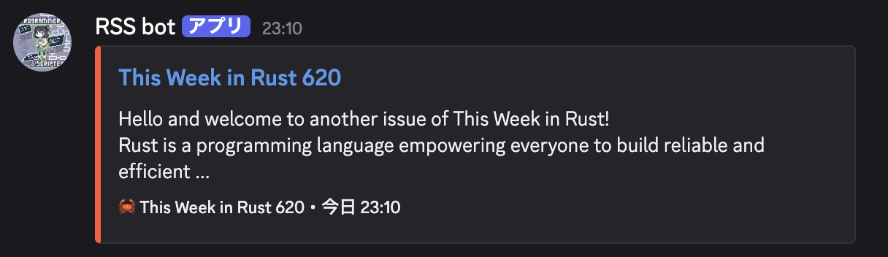

# RSS Discord Bot


[](https://github.com/sifi-border/rss-discord-bot/actions/workflows/ci.yml)

🤖 定期的に RSS feed を収集し、Discordチャンネルに投稿するBot



## Features

- 📰 **自動投稿**: RSS feedを定期的にチェックし、新着記事をDiscordに自動投稿
- 🎨 **リッチ表示**: Discord Embed形式で見やすく表示
- 🔄 **重複防止**: 既に投稿した記事は再投稿しない(jsonで管理)
- ⏰ **定期実行**: GitHub Actionsで自動実行（設定可能）

## Features (MVP)

- [x] RSS feed取得・解析（This Week in Rust）
- [x] 記事Summary生成（100-140字、HTML除去）
- [x] Discord Webhookへの投稿（Embed形式）
- [x] 投稿済み記事の重複チェック
- [x] 定期実行（GitHub Actions）

## Tech Stack

- **Langage**: Rust
- **Async Runtime**: Tokio
- **HTTP Client**: reqwest
- **RSS parse**: feed-rs
- **CI/CD**: GitHub Actions

## Setup

### Requirements

- Rust 1.90+
- Discord Webhookの作成

### Discord Webhook設定

1. Discordサーバー設定 → 連携サービス → Webhook
2. 「新しいWebhook」をクリック
3. 名前とチャンネルを設定
4. Webhook URLをコピー
5. `.env`ファイルを作成しURLを置く

```.env
DISCORD_WEBHOOK_URL="https://discord.com/api/webhooks/..."
```

### Configration（将来実装予定）

`config.toml`:

```toml
[[sources]]
name = "This Week in Rust"
url = "https://this-week-in-rust.org/rss.xml"
category = "Rust"
schedule = "Mon 09:00"
```

## Usage

### ローカル実行

```bash
cargo run
```

### GitHub Actionsで定期実行

1. GitHubリポジトリのSettings → Secretsから`DISCORD_WEBHOOK_URL`を追加
3. `.github/workflows/rss-bot.yml`にてworkflowを実行

## Architecture

```
[RSS Feed Sources]
    ↓ (fetch)
[RSS Parser]
    ↓ (parse)
[Article Filter] ← [Posted Articles (JSON/DB)]
    ↓ (new articles only)
[Discord Poster]
    ↓ (webhook)
[Discord Channel]
```

## References

- [Discord Webhook API](https://discord.com/developers/docs/resources/webhook)
- [GitHub Actions Documentation](https://docs.github.com/en/actions)
- [Rust Async Book](https://rust-lang.github.io/async-book/)
